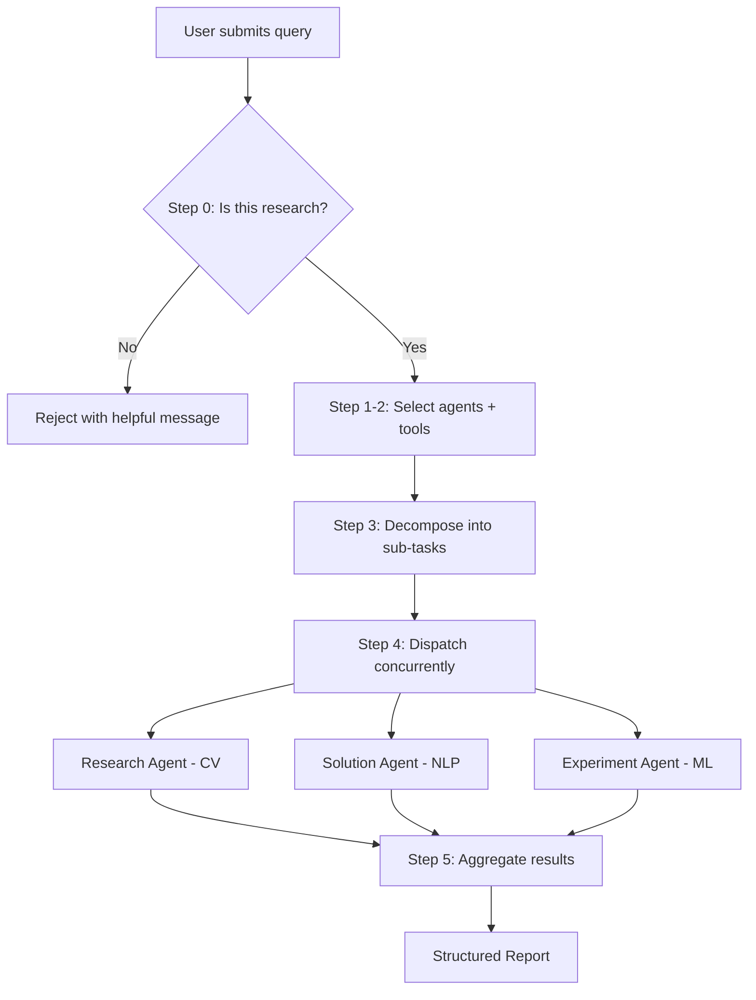
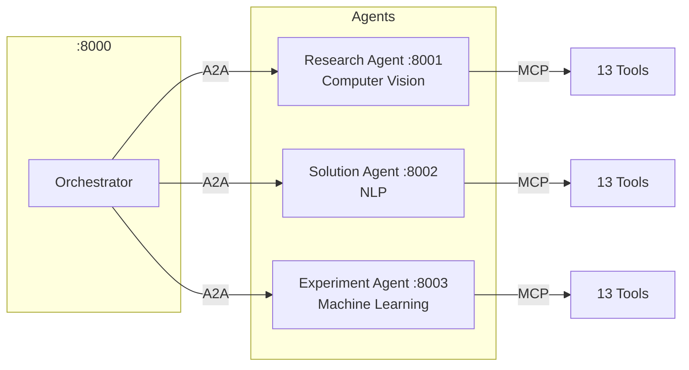
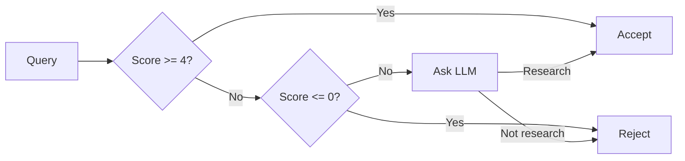
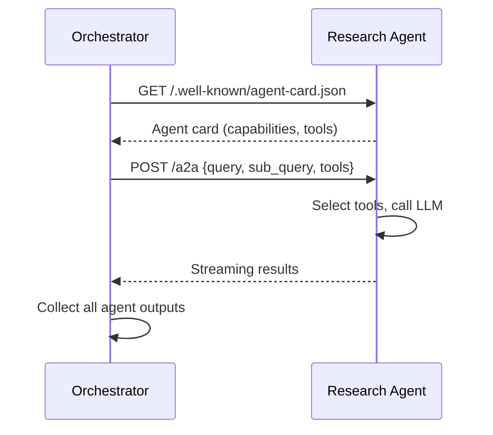
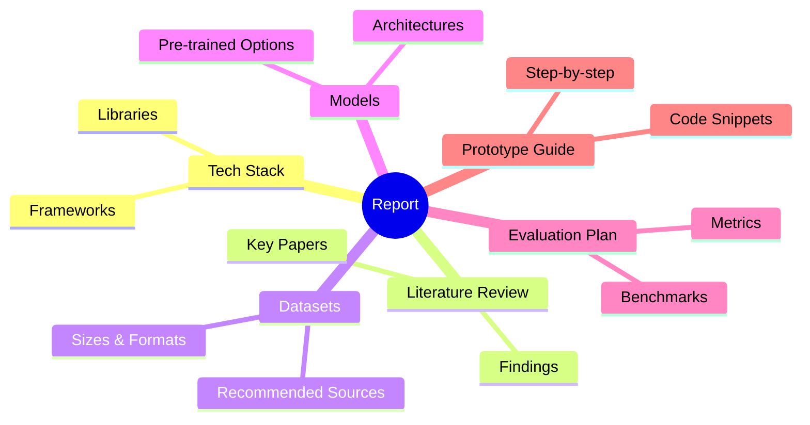
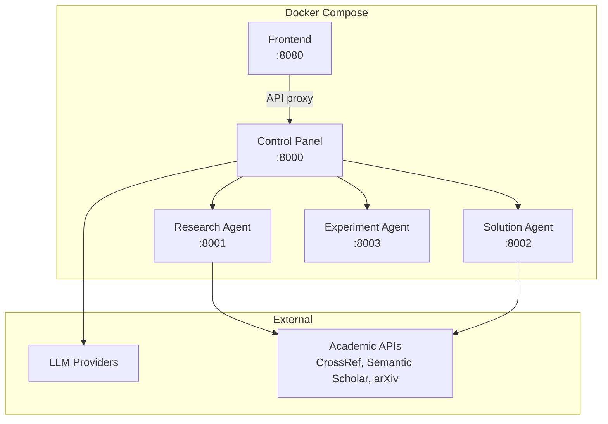

What if you could ask a single question like *"What architecture should I use for multimodal fake news detection?"* and get back a full research report — literature review, recommended datasets, model architectures, evaluation plan, and a prototype roadmap — all in one shot?

That's what **Agent Black V2** does. It's a multi-agent AI system where three specialized agents collaborate to break down research queries and produce structured, actionable reports.

Let me walk through how it works.

---

## The Big Picture

At its core, Agent Black V2 is an orchestration system. A user submits a research query, and a control panel routes it through a 5-step pipeline before producing a final report.



The whole thing streams in real-time to the frontend via SSE, so you see progress as each step completes.

---

## The Three Agents

Each agent is a standalone FastAPI service with its own set of tools. They don't know about each other — the orchestrator handles all the coordination.



Each agent exposes **13 MCP tools** — 7 common (paper search, summarization, citation generation, etc.) and 6 domain-specific. The orchestrator discovers what tools each agent has at runtime, not by hardcoding.

### What the agents actually do

| Agent | Domain | Example Tools |
|---|---|---|
| **Research Agent** | Computer Vision | `cv_datasets`, `cv_models`, `benchmark_search`, `synthetic_data` |
| **Solution Agent** | NLP | `rag_design`, `llm_benchmark`, `prompt_optimizer`, `information_extraction` |
| **Experiment Agent** | ML | `hyperparameter_tuning`, `feature_engineering`, `explainability`, `time_series` |

If your query is about object detection, the Research Agent handles it. If it's about building a RAG pipeline, the Solution Agent steps in. If it needs hyperparameter tuning, the Experiment Agent. Most real queries involve 2-3 agents working together.

---

## Step 0: The Research Gate

Not every query should go through the system. Before anything else, a validation gate checks if the query is actually research-related.

It uses a hybrid approach:

1. **Rule-based scoring** — the query is checked against 40+ AI/ML domain keywords and 20+ research action verbs. Negative patterns (weather, movies, jokes) trigger immediate rejection.
2. **LLM escalation** — borderline queries that score in the middle get sent to an LLM classifier for a final verdict.



This keeps the system focused on what it's good at, while still being helpful when someone asks something off-topic.

---

## How Agents Talk: MCP + A2A

Two protocols make the multi-agent communication work:

**MCP (Model Context Protocol)** — how agents expose their tools. Each agent registers tools via `fastmcp` using JSON-RPC 2.0 over HTTP. The orchestrator can call any tool on any agent through a standard `POST /mcp` endpoint.

**A2A (Agent-to-Agent)** — how agents receive and respond to tasks. Each agent publishes an agent card at `/.well-known/agent-card.json` describing its capabilities. The orchestrator sends tasks via `POST /a2a`, and agents stream back results.



The key insight: agents don't need to know about each other. They just respond to tasks. The orchestrator handles all the coordination.

---

## Concurrent Dispatch

When multiple agents are selected, the orchestrator sends sub-tasks in parallel using `asyncio.gather`:

```python
async def dispatch_tasks(tasks: list[SubTask]) -> list[AgentResult]:
    async with httpx.AsyncClient() as client:
        results = await asyncio.gather(*[
            send_to_agent(client, task) for task in tasks
        ])
    return results
```

This means a query that involves both CV and NLP research gets answers from both agents simultaneously, not sequentially. The whole pipeline typically finishes in under 30 seconds.

---

## Result Aggregation

Once all agents respond, the orchestrator feeds everything to an LLM for synthesis. The final report has a consistent structure:



If the LLM aggregation fails (rate limits, timeouts), a fallback parser extracts sections from the raw agent responses. You always get something back.

---

## The Frontend

The React 19 frontend is built with TanStack Start (SSR) + TanStack Router, styled with Tailwind CSS v4 and shadcn/ui.

Seven pages:

- **Chat** — the main workspace. Type a query, watch the pipeline run, get a report.
- **Dashboard** — system stats at a glance.
- **Agents** — start, stop, restart agents. View health and tool lists.
- **History** — browse past queries and reports.
- **Settings** — switch LLM providers, manage API keys.
- **Diagram** — live Mermaid visualization of the orchestration flow.
- **Logs** — real-time log viewer across all services.

State is managed with Zustand (persisted to localStorage), and data fetching uses TanStack React Query with SSE streaming.

---

## Multi-Provider LLM Support

The system supports three LLM providers, switchable at runtime without restart:

| Provider | Package | Use Case |
|---|---|---|
| Google Gemini | `google-generativeai` | Default, fast |
| OpenAI | `openai` | GPT-4 family |
| Anthropic | `anthropic` | Claude family |

Provider config and API keys are stored in SQLite, not environment variables. You can switch providers from the Settings page while the system is running.

All providers share a common interface with automatic retry (3 attempts, exponential backoff) and a robust `extract_json()` function that handles the JSON-in-markdown-code-fences problem that every LLM developer has fought with.

---

## Infrastructure



Everything runs in Docker Compose locally. For production, a single `deploy.sh` script pulls pre-built images from GitHub Container Registry and starts all five services with health checks.

CI/CD is handled by GitHub Actions — push to `main`, and five Docker images get built and pushed to GHCR automatically.

---

## Some Fun Details

### Hand-Built PDF Generation

The query route includes a PDF generator that builds PDF 1.4 files from raw bytes. No `reportlab`, no `fpdf` — just manual PDF object construction, cross-reference tables, and page trees. About 100 lines of low-level PDF formatting that somehow works perfectly.

### Async SQLite

SQLite isn't natively async, so every database operation has two versions — sync and async. The async wrappers use `asyncio.to_thread()` to run blocking calls in a thread pool without blocking the FastAPI event loop.

### Bun Supply Chain Guard

The frontend's `bunfig.toml` rejects packages published less than 24 hours ago. A small defense against supply-chain attacks.

### Runtime Agent Discovery

The orchestrator doesn't have a hardcoded list of agents. At runtime, it probes each agent's health endpoint and tool list via `shared/discovery.py`. You can add a new agent to the system without touching the orchestrator code.

---

## Running It

```bash
# Clone and install
git clone https://github.com/hareesh08/Agent-BlackV2.git
cd Agent-BlackV2
pip install -r requirements.txt
cd ui && bun install && cd ..

# Start everything
python start.py          # Backend on :8000-8003
cd ui && bun run dev     # Frontend on :8080
```

Or with Docker:

```bash
docker-compose up --build
```

Or deploy to a VPS in one command:

```bash
curl -sSL https://raw.githubusercontent.com/hareesh08/Agent-BlackV2/main/deploy.sh | bash
```

---

## What's Next

- **Conversation threading** — persistent chat history across sessions.
- **Custom agents** — let users create their own agents with custom tool sets.
- **Citation verification** — cross-check paper references against CrossRef and Semantic Scholar.
- **Agent marketplace** — share and discover community-built agents.

---

## Wrapping Up

Agent Black V2 started as an experiment in multi-agent orchestration. Can you get three specialized AI agents to collaborate on a research query and produce something genuinely useful? The answer is yes — but the devil is in the details.

The research gate saves you from wasting LLM tokens on non-research queries. MCP and A2A provide clean, standardized protocols for agent communication. Concurrent dispatch keeps response times reasonable. And the aggregation step turns raw agent outputs into something a human can actually read.

If you want to dig into the code, it's all on GitHub.

**Source:** [github.com/hareesh08/Agent-BlackV2](https://github.com/hareesh08/Agent-BlackV2)
