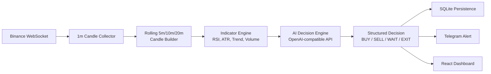
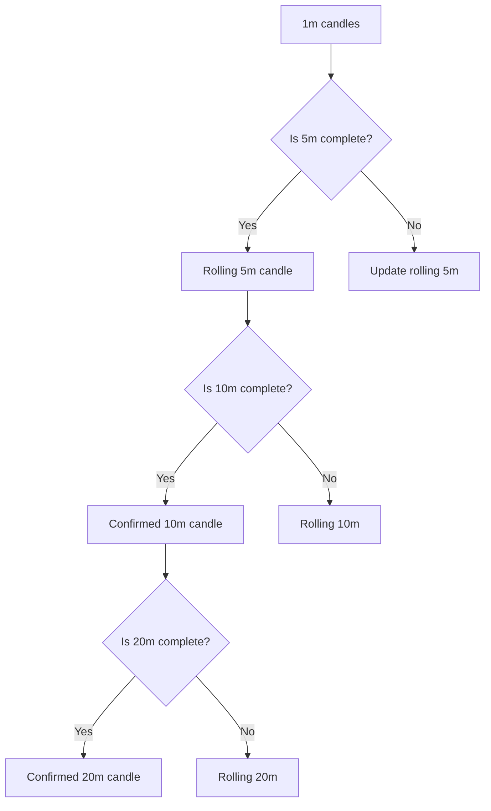
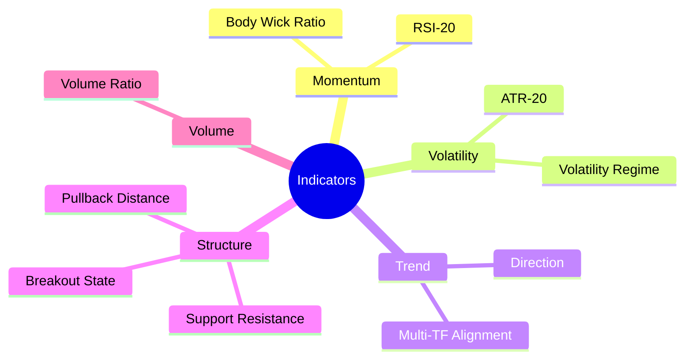
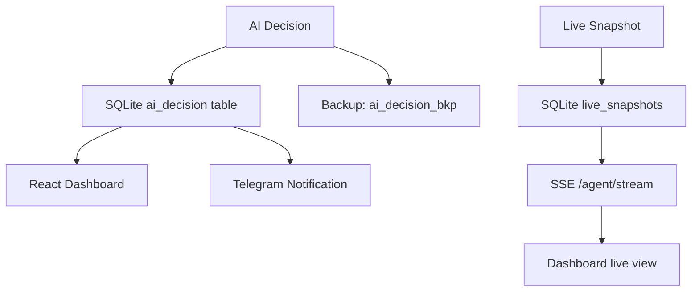
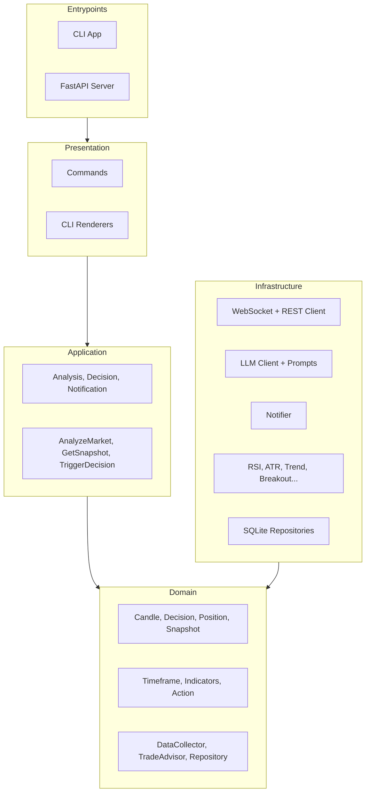
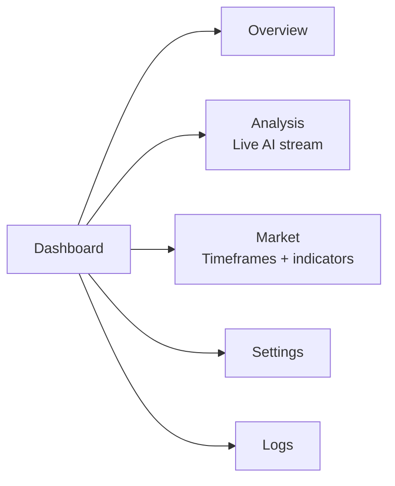

I spend a lot of time staring at crypto charts. The problem isn't the lack of data — it's the noise. Candles, indicators, order books, news — your brain can't hold all of it at once.

So I built **Binance Agent** — a decision assistant that watches Binance markets, builds multi-timeframe snapshots, runs technical analysis, and asks an LLM for a structured trading decision. It doesn't place trades. It tells you what it would do and why.

Here's how it works.

---

## The Core Idea



The whole pipeline runs inside a single Python process. Data flows from WebSocket → snapshot → indicators → AI → dashboard.

---

## What Makes It Different

This is **not a trading bot**. It never places orders. It's a research and decision-support tool — a way to externalize the analysis you'd otherwise do manually, and get a second opinion from an LLM that has read every trading book ever written.

The system runs in several modes:

| Mode | What it does |
|---|---|
| `live` | WebSocket streaming + ANSI terminal dashboard |
| `continuous` | Repeating snapshot + AI analysis on a timer (default 60s) |
| `static` | One-shot analysis, then exit |
| `offline` | No AI — uses a built-in rule-based signal generator |
| `api` | Just the FastAPI backend, no CLI |
| `manual` | Trigger analysis on demand from the dashboard |

The `offline` mode is the safety net. Even if your AI API key runs out or the service goes down, the system still produces heuristic BUY/SELL/WAIT signals using pure math.

---

## The Data Pipeline

### Step 1: Collecting Candles

The system subscribes to Binance's WebSocket kline stream for a symbol (default: `BTCUSDT`):

```python
# Subscribe to closed 1m candles in real-time
await ws.subscribe(f"{symbol}@kline_{interval}")
for closed_candle in ws.iter_closed_candles():
    snapshot_service.add_candle(closed_candle)
```

The WebSocket collector handles reconnection with exponential backoff — up to 20 retries with a base delay of 2 seconds. During disconnections, it bootstraps historical candles via the REST API (`fetch_klines`) so the snapshot is never stale.

### Step 2: Building Multi-Timeframe Snapches

The system doesn't just look at one timeframe. It builds **rolling and confirmed** snapshots across 5m, 10m, and 20m windows:



This means the system always knows the current state across all timeframes, not just the ones that have fully closed.

### Step 3: Computing Indicators

Every snapshot includes a battery of technical indicators:



These are computed in the `infrastructure/calculations/` module — one file per indicator. RSI-20, ATR-20, trend direction, support/resistance levels, breakout state, pullback distance, volatility regime, volume ratio, and a **multi-timeframe alignment score** that tells you whether all timeframes agree on direction.

### Step 4: The AI Decision

The indicators and price action get packed into a structured JSON payload and sent to an OpenAI-compatible API:

```json
{
  "snapshot": { "price": 67234.50, "change_24h": 2.3, ... },
  "indicators": { "rsi": 58.2, "atr": 1240, "trend": "up", ... },
  "multi_tf_alignment": 0.78,
  "history": [ /* compressed last 20 snapshots */ ],
  "position_state": { "status": "flat", "entry_price": null, ... }
}
```

The system expects a strict JSON response:

```json
{
  "action": "BUY",
  "confidence": 0.81,
  "risk_level": "medium",
  "position_action": "enter",
  "entry_trigger": "Break above 67500 with volume confirmation",
  "invalidation": "Close below 66900 on 5m candle",
  "rationale": "RSI recovering from oversold, multi-TF alignment turning bullish..."
}
```

If the AI fails or isn't configured, the `OfflineAnalysisService` kicks in with a simple heuristic scorer.

### Step 5: Persistence and Streaming



Everything is stored in SQLite — decisions, usage stats, events, settings, snapshots. Backup mirror tables (`*_bkp`) exist for every primary table, so you can always recover or inspect historical data.

The `/agent/stream` endpoint uses Server-Sent Events (SSE) to push AI output token-by-token to the dashboard in real-time.

---

## The Tech Stack

**Backend:** FastAPI + Uvicorn, Python 3.10+, with a clean DDD-style architecture — `core`, `domain`, `application`, `infrastructure`, `presentation`, `entrypoints`. Dependency injection via `dependency-injector`.

**AI:** OpenAI-compatible API with streaming. Supports any provider that exposes a `/v1/chat/completions` endpoint — OpenAI, Groq, Together, local models via Ollama, etc.

**Market Data:** Binance REST API + WebSocket via `websockets` + `httpx`. Indicators built from scratch in the `infrastructure/calculations/` module.

**Database:** SQLite with `aiosqlite` (async). Schema migrations run inline at startup.

**Frontend:** React 19 + TypeScript + TanStack Start + TanStack Router + TanStack Query + Tailwind CSS v4 + shadcn/ui + Recharts for charting.

---

## Project Structure

The backend follows a layered DDD architecture:



The domain layer has no dependencies on FastAPI, httpx, or any external framework. Everything is wired through interfaces (ports) and implemented in infrastructure (adapters). This makes it testable and swappable — you could replace Binance with Coinbase or the OpenAI client with Anthropic without touching the domain logic.

---

## Running It

```bash
# Clone
git clone https://github.com/hareesh08/Binance-Agent.git
cd Binance-Agent

# Python deps
pip install -r requirements.txt

# Frontend deps
cd ui && npm install && cd ..

# Configure
cp .env.example .env
# Set OPENAI_API_KEY, BINANCE_SYMBOL, BINANCE_INTERVAL, etc.

# Start everything
python binance_event_bot.py

# In another terminal — frontend
cd ui && npm run dev
```

Then open `http://localhost:5173` for the dashboard.

### Quick architecture notes

- **SQLite is the source of truth.** Settings are loaded from `.env` at startup, merged with persisted SQLite values, and stored back on every change.
- **The AI is pluggable.** Any OpenAI-compatible endpoint works — just set `OPENAI_BASE_URL` and `OPENAI_MODEL`.
- **Telegram is optional.** Set `TELEGRAM_BOT_TOKEN` and `TELEGRAM_CHAT_ID` to enable alerts.

---

## The Dashboard

The React frontend gives you five views:



The Analysis view auto-opens when a run starts, and the AI's response streams in token-by-token — the same SSE stream the API provides.

---

## Design Decisions

### SQLite Over Postgres

For a single-user desktop-style app, SQLite is the right call. No server to manage, no connection pool, no migrations framework — just a file. The async wrappers (`aiosqlite`) make it work cleanly with FastAPI's async handlers. Backup tables (`*_bkp`) give you audit capability without external tools.

### Offline Fallback

Not everyone has an API key. Not everyone wants to rely on an external LLM. The `OfflineAnalysisService` uses a weighted heuristic scorer (RSI extremes, trend alignment, breakout/volatility signals) to produce BUY/SELL/WAIT decisions without any AI call. It's not as nuanced as the LLM, but it works.

### Strict AI Contract

The system enforces a strict JSON schema for AI responses. If the model returns anything outside the expected format, it's rejected and retried. This prevents the dashboard from breaking on a malformed LLM response.

### No Execution

I made a deliberate choice not to add order placement. The moment you connect a system to real funds, you're building financial software — with all the regulatory and risk implications that come with it. This stays in the "decision assistant" lane.

---

## What's Next

- **Position tracking** — track unrealized P&L across multiple entries
- **Backtesting** — replay historical Binance data through the indicator pipeline
- **Multi-symbol support** — watch BTC, ETH, SOL simultaneously
- **Custom indicator plugins** — let users add their own calculation modules
- **Webhook notifications** — Discord, Slack, email alongside Telegram

---

## Source

[github.com/hareesh08/Binance-Agent](https://github.com/hareesh08/Binance-Agent)

> *Not financial advice. This is a decision-support tool, not a trading system. Always do your own research.*
