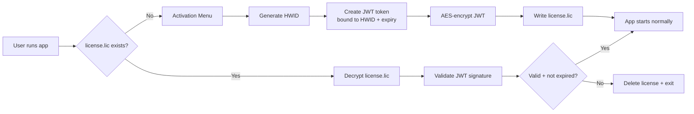
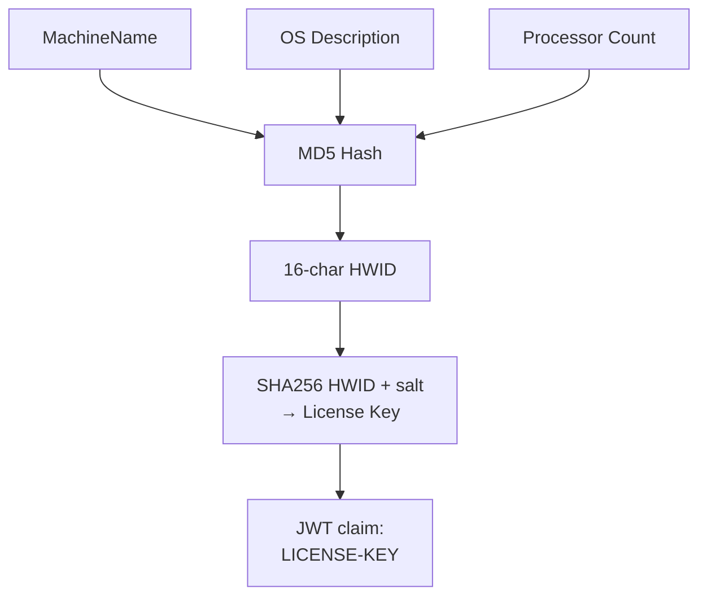
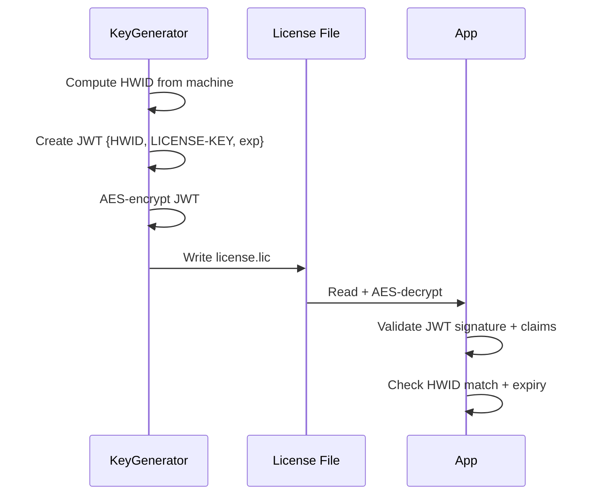
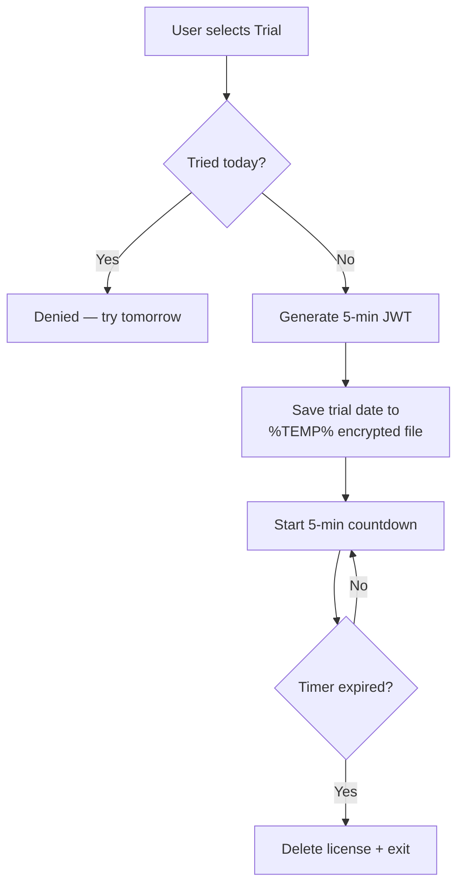
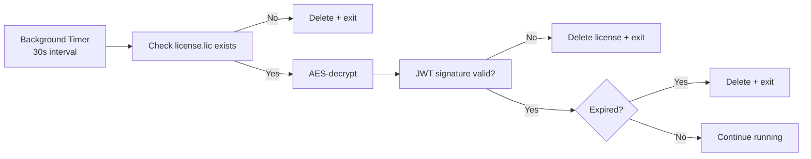

If you've ever shipped a .NET desktop app, you've probably wondered: how do I stop people from just copying the EXE and running it anywhere?

**ButterAuth** is my answer to that question. It's a C# .NET 8 license authentication framework that ties a software license to a specific machine using a hardware fingerprint, JWT tokens, and AES-encrypted license files.

Here's how it works.

---

## The Core Idea



The license is bound to a specific machine. Copy the EXE to another computer and it won't run — the HWID won't match.

---

## How the HWID Works

Every machine gets a unique hardware fingerprint:



The HWID is built from three pieces: `MachineName`, OS description, and processor count. These are hashed with MD5 to produce a 16-character fingerprint. The license key is then derived using SHA256 with a salt.

When the app validates a license, it recomputes the HWID from the current machine and checks it against the one embedded in the JWT. Mismatch = reject.

---

## The License File

The license file (`license.lic`) is double-protected:

1. **AES-encrypted** before being written to disk — casual inspection yields only Base64 ciphertext
2. **JWT-signed** with HMAC-SHA256 — the encrypted payload contains an expiry timestamp and the machine-bound HWID



The key generator creates a JWT with claims for the HWID, a derived license key, the product name, and an expiration timestamp. This JWT is then AES-encrypted before being saved to disk.

---

## The Free Trial

Not everyone wants to buy a license upfront. ButterAuth includes a 5-minute free trial:



The trial is cooldown-gated: a hidden encrypted file in `%TEMP%` records the UTC date the trial was started. The user can only trial once per calendar day. The file is marked `Hidden` to reduce visibility.

---

## Background License Shadow Check

Once the app is running, a background timer polls the license file every 30 seconds:



This means even if someone modifies or deletes the license file while the app is running, it gets caught and terminated within 30 seconds.

There's also a `TitleTimer` that updates the console window title every second with the remaining license validity in `dd Days` format — a subtle visual reminder for the user.

---

## Tech Stack

| Component | Technology |
|---|---|
| Language | C# (.NET 8.0) |
| JWT | `System.IdentityModel.Tokens.Jwt` + `Microsoft.IdentityModel.Tokens` |
| Cryptography | Built-in `System.Security.Cryptography` (AES, MD5, SHA256) |
| Serialization | Newtonsoft.Json, System.Text.Json |
| Native Export | `DllExport` (callable from C/C++ via DllImport) |
| IDE | JetBrains Rider |

---

## Project Structure

```
ButterAuth-1/
├── ButterAuth-1.sln
├── global.json                      # .NET SDK 8.0.0
├── ButterAuth-1/
│   ├── Config/
│   │   └── Configurations.cs        # Crypto keys, paths, salt
│   ├── Security/
│   │   ├── SystemSecure.cs          # AES encrypt/decrypt
│   │   └── Validator.cs             # JWT validation pipeline
│   ├── License/
│   │   ├── LicenseKey.cs            # HWID generation + key derivation
│   │   ├── keygen/
│   │   │   └── KeyGenerator.cs      # Generates + saves license.lic
│   │   └── Jwt/
│   │       ├── JwtGenerate.cs       # JWT creation with expiry options
│   │       ├── JwtSignature.cs      # Signature validation (no expiry)
│   │       └── JwtDecrypt.cs        # Decrypt + extract claims
│   ├── Transaction/
│   │   └── Fetch.cs                 # License file I/O
│   └── Manager/
│       ├── Trial.cs                 # Free trial with cooldown
│       ├── TitleTimer.cs            # Console title countdown
│       └── LicenseShadowCheck.cs    # Background license poller
```

---

## Usage Flow

1. **First run** — no `license.lic` found → activation menu appears
2. **Option 1** — enter a JWT license key (generated by the KeyGenerator tool for this machine)
3. **Option 2** — start a 5-minute free trial (once per day)
4. **Option 3** — exit
5. **Subsequent runs** — decrypt, validate JWT, check HWID and expiry → proceed or exit

The key generator prompts for an expiry duration (5 min to 1 year), generates a JWT bound to the current machine's HWID, encrypts it with AES, and writes `license.lic`.

---

## Notable Design Choices

- **DllExport support** — the library can be exported to native callers via `DllExport`, making it usable from C/C++ applications, not just .NET.
- **Signature pre-check** — `JwtSignature.IsJwtSignatureValid()` does a fast first-pass validation without checking expiry, used as a gate before full validation.
- **Callback-based shadow check** — `LicenseShadowCheck` uses action callbacks (`onLicenseValid`, `onLicenseInvalid`) so the hosting app can customize behavior.

---

## Security Note

The current implementation uses hardcoded cryptographic keys (AES key, JWT secret, IV) for development. In production, these should be obfuscated or replaced with asymmetric cryptography (RSA/ECDSA) where the private key stays server-side.

---

## Source

[github.com/hareesh08/ButterAuth-1](https://github.com/hareesh08/ButterAuth-1)
