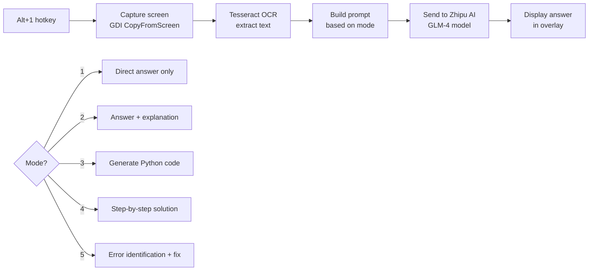
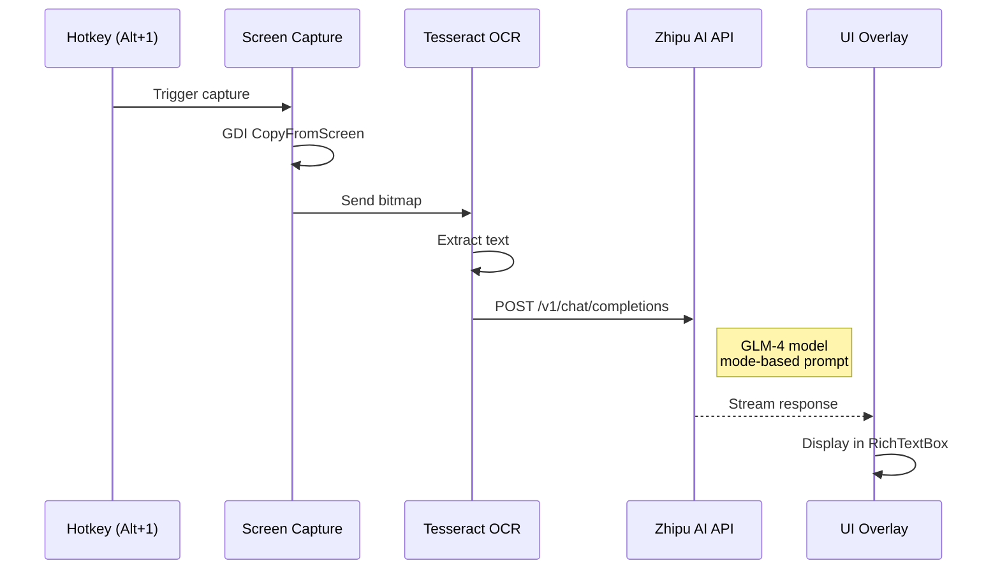
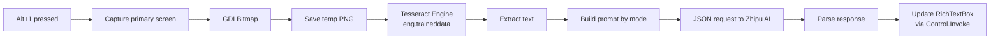

You're taking an exam. A multiple-choice question appears on screen. You need an answer, fast.

**ExamBotV2** is a transparent, always-on-top overlay that captures your screen, extracts the question text using Tesseract OCR, and sends it to an AI for an instant answer — all triggered by pressing `Alt+1`.

No context switching. No typing. Just screenshot → answer.

---

## How It Works



Five answer modes. One hotkey. Results appear in a semi-transparent overlay window that stays on top of everything.

---

## The Stack

| Component | Technology |
|---|---|
| Language | C# (.NET 8.0) |
| UI | Windows Forms (transparent overlay) |
| OCR | Tesseract 5.x (bundled `tessdata`) |
| AI | Zhipu AI API (GLM-4 model) |
| Screen Capture | GDI+ `Graphics.CopyFromScreen` |
| Window Styling | Win32 `SetWindowLong` (layered, tool window, topmost) |
| Hotkeys | `RegisterHotKey` (user32.dll) |

---

## Screen Capture → OCR → AI



The prompt changes based on the selected mode. Mode 1 asks for just the answer. Mode 2 asks for an explanation. Mode 3 asks for Python code. Mode 4 asks for a step-by-step solution. Mode 5 asks for error identification and a fix.

---

## The Overlay Window

The app runs as a borderless, transparent, always-on-top Windows Forms window:

```mermaid
graph TD
    A[WinForms Form] --> B[Borderless]
    A --> C[TopMost = true]
    A --> D[90% opacity]
    A --> E[Dark background<br/>Color.FromArgb(30,30,30)]

    F[Win32 styling] --> G[WS_EX_LAYERED]
    F --> H[WS_EX_TOOLWINDOW<br/>hide from Alt+Tab]
    F --> I[SetWindowLong P/Invoke]
```

Positioned at the top-right of the primary screen. The `WS_EX_TOOLWINDOW` style keeps it out of Alt+Tab and the taskbar. The layered window style enables per-pixel transparency.

---

## OCR Pipeline



The OCR engine uses Tesseract 5.x with the English trained data file. The `OcrProcessor` initializes the engine on startup and processes the captured bitmap. Thread-safe UI updates use `Control.Invoke` to marshal the response back to the UI thread.

---

## Project Structure

```
ExamBotV2/
├── ExamBotV2.sln
├── global.json
├── Tesseract-OCR/
│   └── tessdata/
│       ├── eng.traineddata
│       └── osd.traineddata
└── ExamBotV2/
    ├── Program.cs              # WinForms bootstrap
    ├── ApiClient.cs            # Zhipu AI HTTP client
    ├── ScreenOverlay.cs        # Main form + hotkeys + capture
    └── Utils.cs
        ├── ScreenCapture       # GDI capture
        ├── OcrProcessor        # Tesseract wrapper
        └── ImageUtils          # Base64 helper
```

---

## Running It

```bash
cd D:\C#\Commercial\ExamBotV2
dotnet restore
dotnet build
dotnet run --project ExamBotV2\ExamBotV2.csproj
```

Make sure `Tesseract-OCR\tessdata\eng.traineddata` is present. Replace the placeholder API key in `ApiClient.cs` with a valid Zhipu AI key.

---

## Source

[github.com/hareesh08/ExamBotV2](https://github.com/hareesh08/ExamBotV2)
