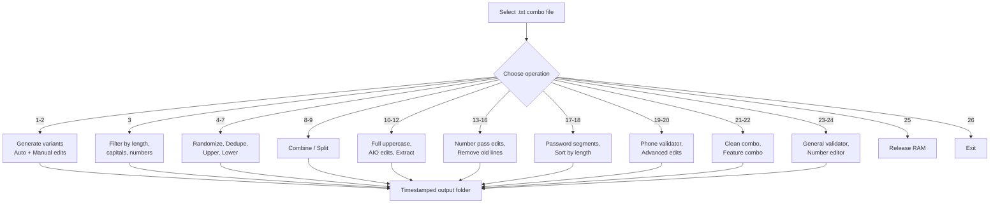
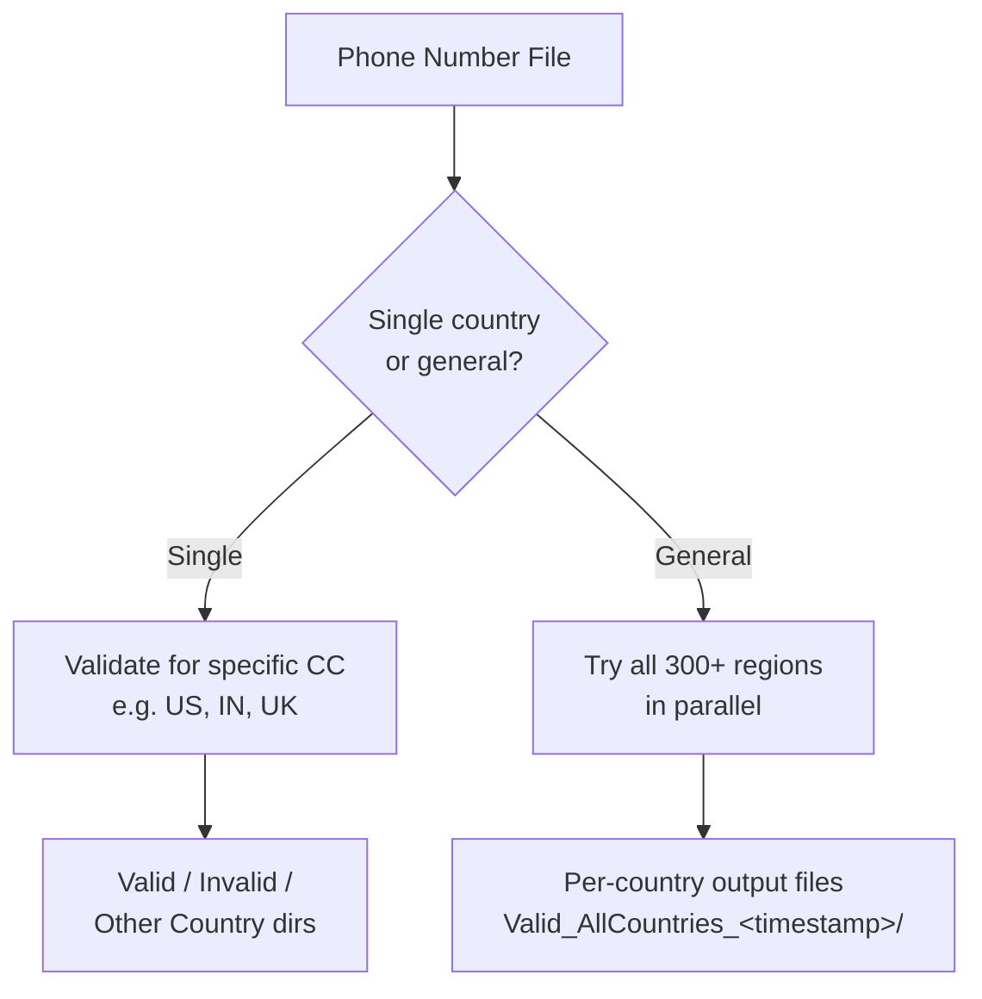
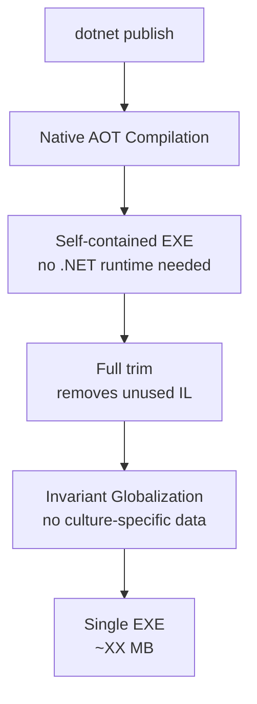

When you're working with large text files full of `email:password` or `user:password` combos, even simple operations become tedious when you have millions of lines.

**FixcomboV3** is my answer — a self-contained, AOT-compiled Windows console app that packs **26 operations** into a single interactive menu. Filter, shuffle, split, dedupe, validate phone numbers, generate leet-speak variants, categorize passwords, and more.

No dependencies. No runtime needed. Just `FixcomboV3.exe` and your combo file.

---

## What It Does



---

## The 26 Operations

| # | Operation | What it does |
|---|---|---|
| 1 | **Auto Edits** | Generates original + first-letter-cap + symbol suffixes (`!`, `$`, `*`, `#`, `@`, `!!`, `@123`, `0`) |
| 2 | **Manual Edits** | Same as #1 but with custom user-supplied suffixes |
| 3 | **Combo Filter** | Filters by min/max password length, removes entries without capitals or numbers |
| 4 | **Randomize** | Fisher-Yates shuffle of all lines |
| 5 | **Remove Duplicates** | Deduplicates using `HashSet` |
| 6 | **Uppercase (First Letter)** | Capitalizes first letter of each password |
| 7 | **Lowercase** | Lowercases first letter |
| 8 | **Combine** | Merges all `.txt` files from a `combine/` subdirectory |
| 9 | **Split** | Splits file by fixed lines-per-part or N equal parts |
| 10 | **Full Uppercase** | Converts entire password to uppercase |
| 11 | **AIO Edits** | Filter + dedupe + randomize in one shot |
| 12 | **Extract Email:Pass** | Keeps only lines where left side is a valid email |
| 13 | **Extract User:Pass** | Keeps only non-email usernames |
| 14 | **Number Pass Edits** | Filter `number:pass` by number length, password length, starting digit |
| 15 | **Remove Old Lines** | Removes lines found in a previous combo folder |
| 16 | **Password Segments** | Categorizes passwords into 12 types (uppercase-only, mixed, special-char, etc.) |
| 17 | **Password Sort** | Sorts and splits by password length into separate files |
| 18 | **Number Validator** | Validates phone numbers for a specific country using `libphonenumber-csharp` |
| 19 | **Advanced Edit V1** | Case variants + leet speak + custom prefixes/suffixes + symbol-before-number |
| 20 | **Clean Combo** | Strips non-ASCII, illegal chars, separates into email/user/number outputs |
| 21 | **Feature Combo** | Cleaning + filtering + categorization + shuffle in one pipeline |
| 22 | **Number Validator General** | Auto-detects country for every number, parallel processing |
| 23 | **Number Editor General** | Add/remove country codes, filter by number type (mobile, fixed-line, etc.) |
| 24 | **Release RAM** | Forces aggressive garbage collection |
| 25 | **About** | Shows info |
| 26 | **Exit** | Quits |

---

## Phone Number Validation

Two validators powered by `libphonenumber-csharp`:



The general validator tries all supported regions in parallel using `Parallel.ForEach` with thread-safe file writes via `SemaphoreSlim` locks.

---

## Advanced Edits: Leet Speak Generator

The most creative operation — it transforms passwords through multiple strategies:

```mermaid
flowchart LR
    A[Original password] --> B{Case transform}
    B -->|lower| C[all lowercase]
    B -->|upper| D[all uppercase]
    B -->|title| E[Title Case]

    A --> F[Leet substitution]
    F -->|a → @| G[leet variants]
    F -->|e → 3| G
    F -->|o → 0| G
    F -->|s → $| G
    F -->|i → 1| G

    A --> H[Custom prefix/suffix]
    H --> I[user! , 123$ , etc.]

    A --> J[Symbol before number]
    J --> K[p@ssw0rd → p@ssw0rd!]

    C --> L[Combine all → write to file]
    D --> L
    E --> L
    G --> L
    I --> L
    K --> L
```

---

## Memory Management

Processing multi-gigabyte combo files requires careful memory management. After every operation:


That's 7 full garbage collection cycles after every single feature. Aggressive? Yes. Effective? Also yes — especially when processing files with tens of millions of lines.

---

## Build Configuration

The project is configured for maximum deployment portability:



- **Native AOT** — compiles to native code, not IL
- **Self-contained** — bundles the .NET runtime
- **Full trim** — aggressive IL trimming
- **Invariant globalization** — removes culture data to reduce size
- **Windows Forms** — used solely for `OpenFileDialog` and `FolderBrowserDialog` in a console app

The pre-built `publish/` folder contains a ready-to-run `FixcomboV3.exe` with all native dependencies — no .NET installation required.

---

## Tech Stack

| Component | Technology |
|---|---|
| Language | C# 10/11 (.NET 8.0) |
| UI | Windows Forms (file dialogs only) |
| Phone Validation | `libphonenumber-csharp` v9.0.5 |
| Build | Native AOT, Self-Contained, Full Trim |
| Concurrency | `Parallel.ForEach`, `async/await`, `SemaphoreSlim` |
| IDE | JetBrains Rider |

---

## Running It

```bash
# Debug
dotnet run --project FixcomboV3\FixcomboV3.csproj

# Publish (self-contained AOT, Windows x64)
dotnet publish FixcomboV3\FixcomboV3.csproj -c Release -r win-x64 --self-contained true /p:PublishAot=true
```

Or just run the pre-built `publish/FixcomboV3.exe` — no installation needed.

---

## Source

[github.com/hareesh08/FixcomboV3](https://github.com/hareesh08/FixcomboV3)
