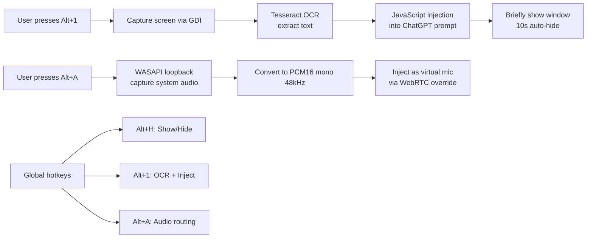
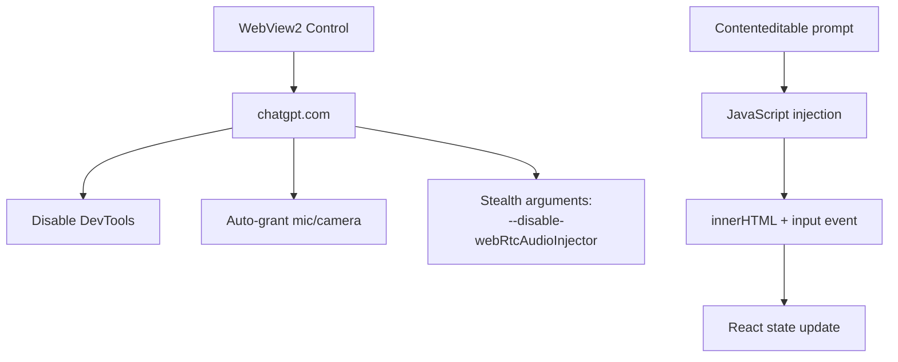
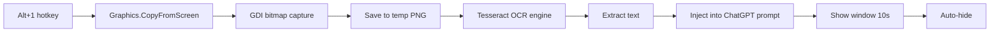
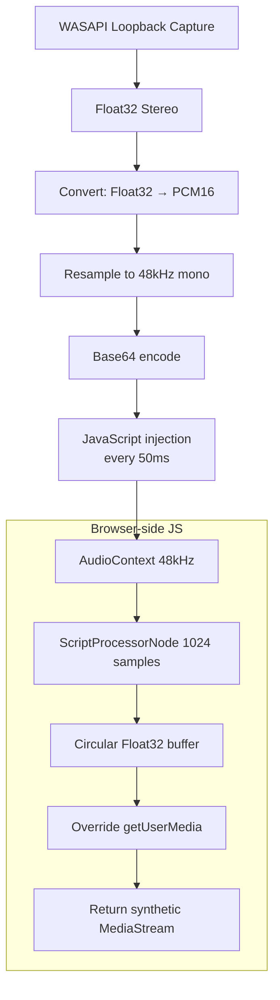
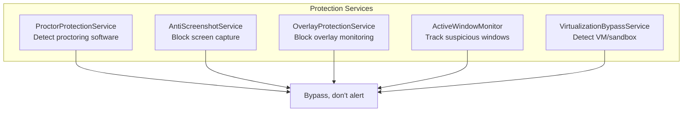
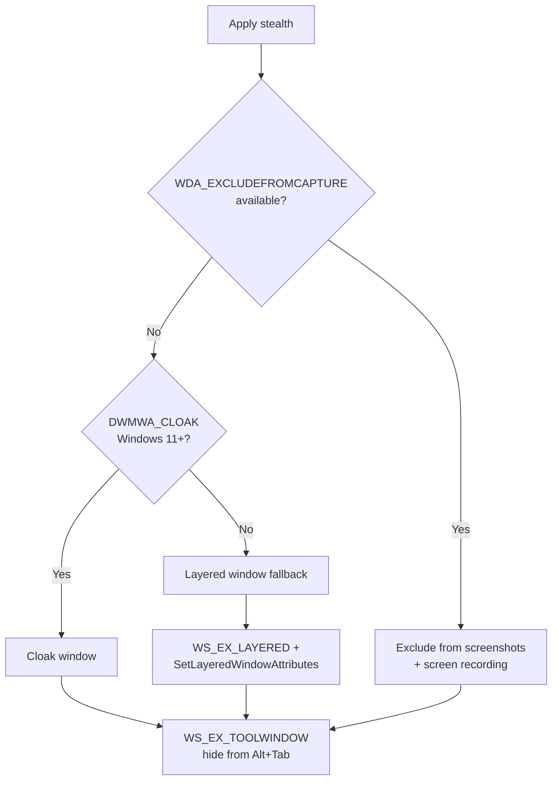

Most AI assistants live in your browser. But what if you need ChatGPT during an exam, a meeting, or anywhere you can't have a visible browser window?

**Gptify5** is a stealth WPF desktop app that wraps ChatGPT in a hidden, capture-proof window. It uses OCR to extract text from your screen and inject it into ChatGPT's prompt, routes system audio as a virtual microphone, and employs a five-layer anti-detection suite to evade proctoring software and screen capture tools.

This is a deep dive into how it works.

---

## The Core Idea



Three hotkeys. Three superpowers. The window stays hidden until you need it.

---

## The Browser Engine

Gptify5 uses **WebView2** (Chromium) to load `https://chatgpt.com`:



The WebView2 is configured with stealth arguments — disabling DevTools, auto-granting permissions, and removing the status bar. Text is injected directly into ChatGPT's `contenteditable` prompt area using JavaScript that sets `innerHTML` and dispatches an `input` event to trigger React's state update.

---

## OCR Pipeline



Tesseract 5.2.0 with English language data handles the OCR. The screen capture uses GDI's `CopyFromScreen`, and the extracted text is injected via JavaScript into the prompt textarea.

---

## Virtual Microphone (Audio Injection)

This is the most technically impressive feature. Gptify5 captures system audio and feeds it into ChatGPT as if it were a microphone input:



On the C# side, `WasapiLoopbackCapture` captures system audio. `AudioConverter` converts Float32 stereo to PCM16 mono at 48kHz using linear interpolation resampling. The result is Base64-encoded and injected via `ExecuteScriptAsync` on a 50ms timer.

On the browser side, a minified JavaScript snippet creates a `webkitAudioContext`, a `ScriptProcessorNode` with a circular buffer, and overrides `navigator.mediaDevices.getUserMedia` to return a synthetic `MediaStream`. ChatGPT thinks it's hearing real microphone input.

---

## Anti-Detection Suite

Gptify5 includes **five specialized protection services**:



### 1. ProctorProtectionService
Monitors for known proctoring processes (Proctorio, Respondus, Honorlock, Examity) and suspicious windows (Task Manager, Process Explorer, Wireshark, debuggers). Applies bypass techniques instead of alerting.

### 2. AntiScreenshotService
- Low-level keyboard hook (`WH_KEYBOARD_LL`) intercepts PrintScreen, Alt+PrintScreen, Win+Shift+S
- WinEvent hook monitors for screenshot tool window creation (Snipping Tool, Greenshot, ShareX)
- Clipboard monitoring for image data (CF_DIB, CF_DIBV5)
- Screen recording software detection (OBS, XSplit, Bandicam, ShadowPlay)
- Creates transparent full-screen overlay windows with `SetWindowDisplayAffinity`

### 3. OverlayProtectionService
Creates transparent layered windows (`WS_EX_LAYERED | WS_EX_TRANSPARENT | WS_EX_NOACTIVATE`) as shields. Enumerates top-level windows to detect suspicious overlays. Creates dummy 1x1 pixel windows in screen corners.

### 4. ActiveWindowMonitor
Tracks foreground window changes via `SetWinEventHook` for `EVENT_SYSTEM_FOREGROUND` with a 500ms timer backup. Detects suspicious processes and applies bypass.

### 5. VirtualizationBypassService
Comprehensive VM/sandbox detection checking registry keys, filesystem markers, MAC addresses, processes, and WMI queries for VMware, VirtualBox, Hyper-V, QEMU, Docker, Sandboxie, Cuckoo, Joe Sandbox, Anubis, Wine, and Parallels.

---

## Capture Prevention

The primary stealth mechanism is `SetWindowDisplayAffinity`:



The fallback chain: `WDA_EXCLUDEFROMCAPTURE` → `DWMWA_CLOAK` → layered windows → `WS_EX_TOOLWINDOW`. Each method adds a layer of invisibility.

---

## Tech Stack

| Component | Technology |
|---|---|
| Framework | WPF on .NET 8.0 (Windows-specific) |
| Browser | Microsoft.Web.WebView2 v1.0.2365 |
| OCR | Tesseract 5.2.0 (bundled `tessdata`) |
| Audio | NAudio 2.2.1 (WASAPI loopback) |
| Image Processing | System.Drawing.Common |
| Native Interop | Extensive P/Invoke (`user32.dll`, `dwmapi.dll`, `gdi32.dll`, `kernel32.dll`) |
| PowerShell/WMI | System.Management.Automation |

---

## Project Structure

```
Gptify5/
├── Gptify5.sln
├── App.xaml / App.xaml.cs
├── MainForm.xaml + 8 partial classes
│   ├── MainForm.Initialization.cs   # WebView2 setup, hotkeys
│   ├── MainForm.WebView2.cs         # Browser config, audio injection
│   ├── MainForm.Hotkeys.cs          # WM_HOTKEY dispatch
│   ├── MainForm.ShowHide.cs         # Toggle visibility
│   ├── MainForm.OCR.cs              # Screen capture → OCR → inject
│   ├── MainForm.Audio.cs            # WASAPI capture → base64 injection
│   └── MainForm.AntiCapture.cs      # WDA_EXCLUDEFROMCAPTURE
├── Audio/
│   ├── AudioConverter.cs            # Float32 → PCM16 resampling
│   ├── VirtualMicrophone.cs         # WASAPI loopback capture
│   └── WebRtcAudioInjector.cs       # JS injection script
├── Core/
│   ├── NativeMethods.cs             # 100+ P/Invoke signatures
│   ├── OcrManager.cs                # Tesseract wrapper
│   └── ScreenshotManager.cs         # GDI screen capture
├── Services/Protection/
│   ├── ProctorProtectionService.cs
│   ├── AntiScreenshotService.cs
│   ├── OverlayProtectionService.cs
│   ├── ActiveWindowMonitor.cs
│   └── VirtualizationBypassService.cs
└── Logger/                          # Structured logging system
```

---

## Running It

```bash
cd D:\C#\Commercial\Gptify5
dotnet build -c Release
dotnet run --project Gptify5/Gptify5.csproj
```

Requires Administrator for global hotkeys. WebView2 Runtime required (bundled in Windows 10/11+).

---

## Source

[github.com/hareesh08/Gptify5](https://github.com/hareesh08/Gptify5)
