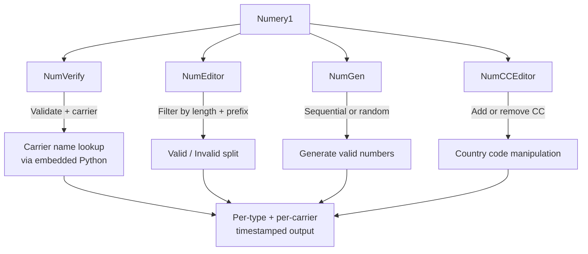
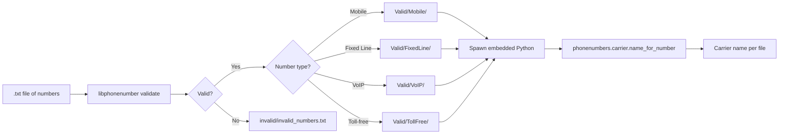
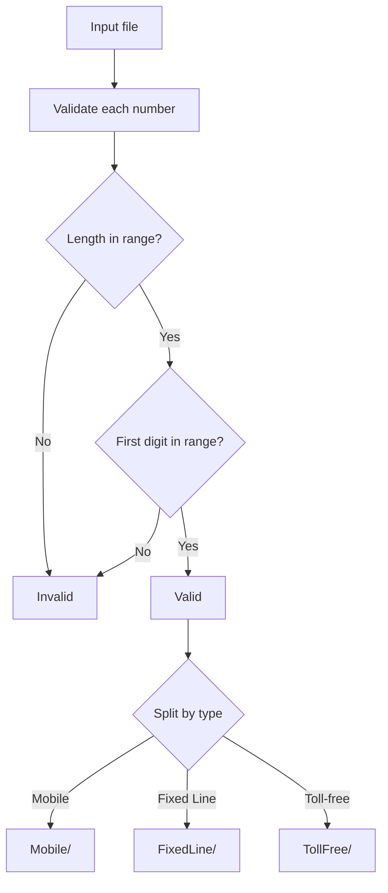
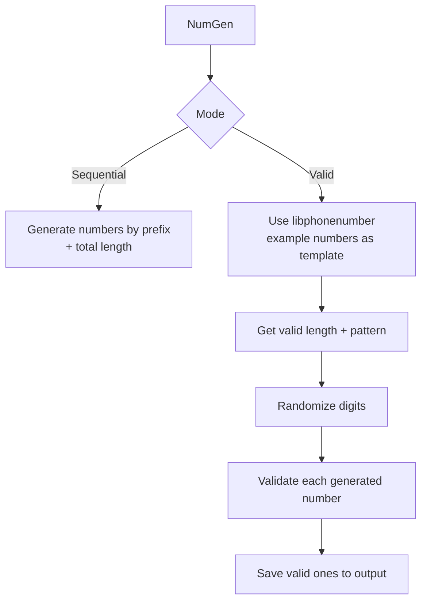
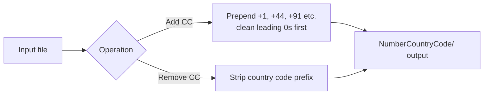
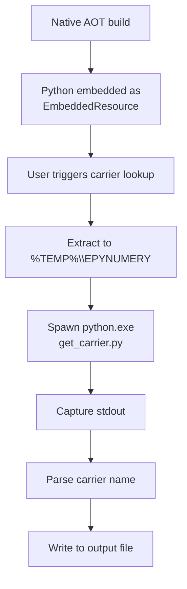
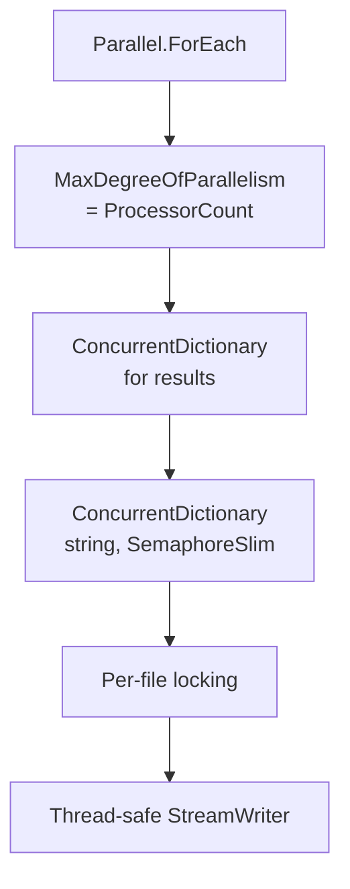
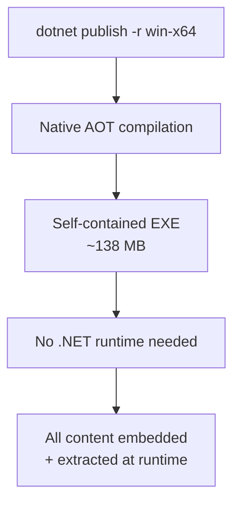

Phone numbers deceptively simple until you try to process them at scale. Country codes, formatting rules, carrier lookups, number types — every country does it differently.

**Numery1** is my .NET 8 console tool that handles all of it: validation, editing, generation, country code manipulation, and carrier lookups — all powered by Google's `libphonenumber` library and an **embedded Python 3.12 runtime**.

---

## The Four Features



---

## NumVerify: Validation + Carrier Lookup

The most interesting feature. It validates phone numbers for a specific country and looks up the carrier name:



The carrier lookup works by **embedding a full Python 3.12 runtime** inside the .NET executable. At runtime, the Python environment is extracted to `%TEMP%\EPYNUMERY`, and `get_carrier.py` is spawned as a child process:

```python
# get_carrier.py
import phonenumbers, sys
number = sys.argv[1]
country = sys.argv[2]
parsed = phonenumbers.parse(number, country)
carrier = phonenumbers.carrier.name_for_number(parsed, "en")
print(carrier)
```

The C# side captures `StandardOutput` and routes the carrier name to the correct output file.

---

## NumEditor: Filter + Edit

Filters numbers by digit length range and starting digit prefix:



Uses `Parallel.ForEach` with `MaxDegreeOfParallelism = Environment.ProcessorCount` and thread-safe file writes via `ConcurrentDictionary<string, SemaphoreSlim>`.

---

## NumGen: Number Generation

Two generation modes:



Mode A generates sequential numbers (e.g., all 10-digit numbers starting with `98`). Mode B uses `libphonenumber`'s example number database to generate syntactically valid numbers for a given country.

---

## NumCCEditor: Country Code Manipulation



Uses async I/O with per-file `SemaphoreSlim` locks for thread-safe parallel writes.

---

## Embedded Python Runtime

The most technically interesting part of the project. The entire Python 3.12 distribution is embedded as resources in the .NET assembly:



Because Native AOT doesn't support `GetManifestResourceStream` the same way, the Python distribution is manually extracted to disk on first use. The `get_carrier.py` script uses `phonenumbers.carrier.name_for_number()` to return carrier names in English.

> ⚠️ There's a minor cleanup bug — the extraction goes to `%TEMP%\EPYNUMERY` but the cleanup code tries to delete `%TEMP%\EmbeddedPython`. The Python runtime is never cleaned up, but it's a small price for functionality.

---

## Concurrency Model

All features use parallel processing with thread-safe patterns:



Each feature uses `ConcurrentDictionary<string, SemaphoreSlim>` for per-file locking, ensuring that multiple threads never write to the same file simultaneously.

---

## Native AOT Build



The published executable is ~138 MB — large because it bundles the Python runtime, .NET runtime, and native libraries. But it runs on any Windows x64 machine without installation.

---

## Tech Stack

| Component | Technology |
|---|---|
| Language | C# (.NET 8) |
| Phone Validation | `libphonenumber-csharp` v9.0.8 |
| Carrier Lookup | Embedded Python 3.12 + `phonenumbers` package |
| Build | Native AOT, Self-Contained, `win-x64` |
| Concurrency | `Parallel.ForEach`, `SemaphoreSlim`, `ConcurrentDictionary` |
| UI | Windows Forms (OpenFileDialog only) |

---

## Project Structure

```
Numery1/
├── Numery1.sln
├── global.json
├── pyembed/                    # Python 3.12 distribution
│   ├── python.exe, python3.dll
│   ├── Lib/site-packages/phonenumbers/
│   └── get_carrier.py
├── publish/                    # Pre-built ~138MB EXE
└── Numery1/
    ├── NumVerify.cs            # Validate + carrier lookup
    ├── NumEditor.cs            # Filter by length + prefix
    ├── NumGen.cs               # Sequential + valid number generation
    ├── NumCCEditor.cs          # Country code add/remove
    ├── ExternelPyCarrierValidator.cs  # Spawns embedded Python
    └── FileUtil.cs             # File dialog, banner, cleanup
```

---

## Running It

```bash
# Debug
dotnet run --project Numery1\Numery1.csproj

# Publish (self-contained AOT)
dotnet publish Numery1\Numery1.csproj -c Release -r win-x64 --self-contained
```

Or just run the pre-built `publish/Numery1.exe`.

---

## Source

[github.com/hareesh08/Numery1](https://github.com/hareesh08/Numery1)
