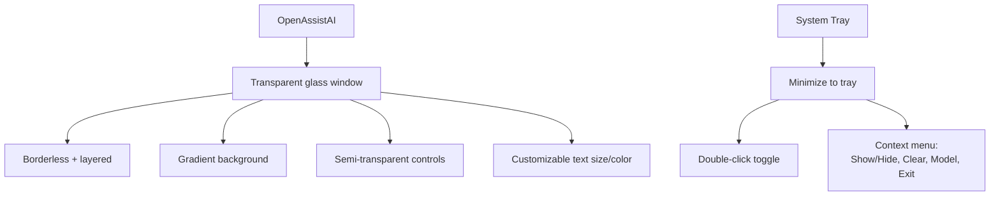
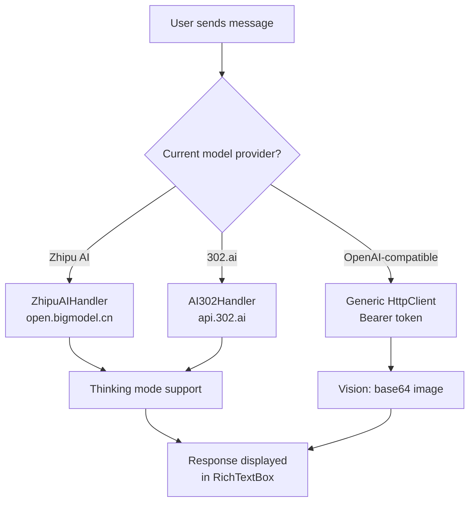
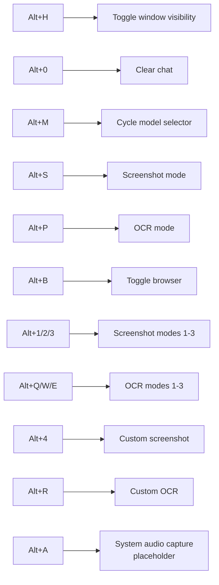
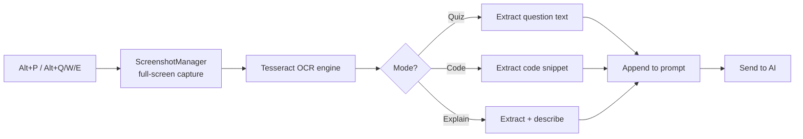
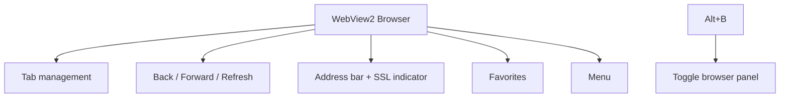
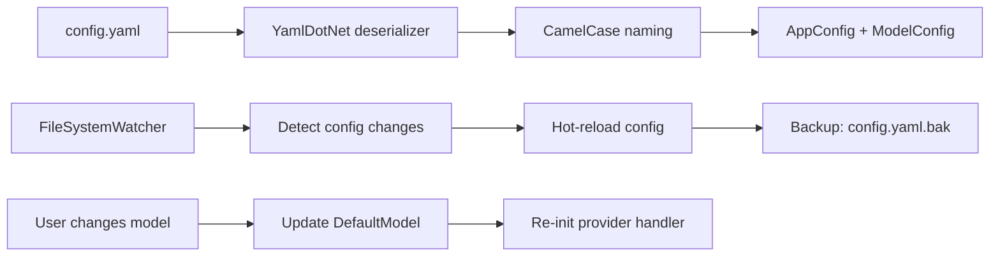
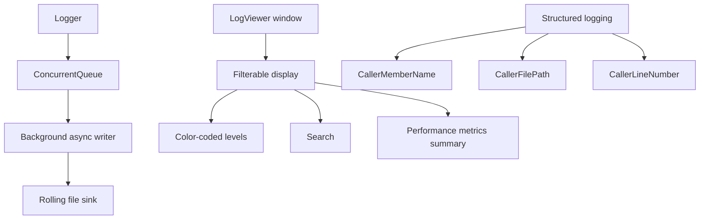

Most AI assistants live in your browser tab. But what if you want an AI that floats above your other windows, responds to global hotkeys, can read your screen via OCR, and even has its own built-in browser?

**OpenAssistAI** is a transparent, glass-effect WPF desktop application that does all of that. It's a universal AI client supporting multiple providers, models, and input modalities — with an interface that looks like it belongs in a sci-fi movie.

---

## The Interface



The window is borderless, transparent, and always-on-top. It uses `SetWindowDisplayAffinity(WDA_EXCLUDEFROMCAPTURE)` to prevent screenshots. The glass-effect background uses gradient fills with per-pixel alpha. Text size, text color, and background color are all user-configurable from a settings panel.

---

## Multi-Provider AI Support

OpenAssistAI isn't locked to a single AI provider. It supports three:



Each provider has its own handler implementing a common interface. The `ResponseHandler` delegates to the correct handler based on the current model's endpoint. Configuration is managed via `config.yaml` with hot-reload via `FileSystemWatcher`.

---

## Global Hotkeys



All hotkeys require the `Alt` modifier and use `RegisterHotKey` with `MOD_NOREPEAT` to prevent repeated firings. Messages are intercepted via `HwndSource.AddHook(WndProc)`.

---

## OCR Pipeline



The `OcrManager` wraps Tesseract 5.2.0 with the bundled English trained data. `ScreenshotManager` captures the full screen or active window via GDI. For non-vision models, OCR text is appended to the prompt. For vision models, the image is converted to base64 JPEG (resized to max 800×600) and sent as `image_url`.

---

## Built-in Browser

OpenAssistAI includes a full Chromium browser via WebView2:



The browser supports tab management, navigation controls, an address bar with SSL status indicator, and a favorites system. It can be toggled via the `Alt+B` hotkey.

---

## Configuration Management



Configuration is managed via `config.yaml` with YAML serialization using `CamelCaseNamingConvention`. The `ConfigManager` watches for file changes via `FileSystemWatcher` and auto-reloads. A backup is created before any write operation.

---

## Logging System



The logging system uses a `ConcurrentQueue<LogEntry>` with a background async writer task. It supports structured logging with caller information and performance timing. The `LogViewer` provides filterable, searchable log display with color-coded levels and performance metrics.

---

## Tech Stack

| Component | Technology |
|---|---|
| Framework | WPF on .NET 8.0 (Windows-specific) |
| Browser | Microsoft.Web.WebView2 v1.0.3537 |
| OCR | Tesseract 5.2.0 (bundled `tessdata`) |
| Audio | NAudio 2.2.1 (WASAPI) |
| Speech | Whisper.net 1.4.0 (placeholder) |
| Image Processing | System.Drawing.Common |
| JSON | Newtonsoft.Json 13.0.3 |
| Config | YamlDotNet 16.3.0 |
| Build | ReadyToRun, `win-x64` |

---

## Project Structure

```
OpenAssistAI/
├── OpenAssistAI.sln
├── global.json
├── config.yaml                      # Models, API keys, settings
├── MainWindow.xaml + .cs            # Main WPF window
├── Core/
│   ├── NativeMethods.cs             # Win32 interop
│   ├── OcrManager.cs                # Tesseract wrapper
│   └── ScreenshotManager.cs         # GDI screen capture
├── Internals/
│   ├── ResponseHandler.cs           # AI request orchestrator
│   ├── ModelConfiguration.cs        # Model + AppConfig
│   ├── CoreUtilities.cs             # UI utils, prompt builder, config
│   ├── HotkeyManager.cs             # Global hotkeys
│   ├── Api/
│   │   ├── ZhipuAIHandler.cs        # Zhipu AI provider
│   │   └── AI302Handler.cs          # 302.ai provider
│   └── Logging/
│       ├── Logger.cs                # Async file logger
│       ├── LoggingExtensions.cs
│       └── LogViewer.cs             # WPF log viewer
└── Tesseract-OCR/                   # Bundled OCR binaries
```

---

## Running It

```bash
cd D:\C#\Commercial\OpenAssistAIV2
dotnet build -c Release
dotnet run --project OpenAssistAI\OpenAssistAI.csproj
```

Edit `config.yaml` to configure your models and API keys. The app starts minimized to the system tray — double-click the tray icon to show.

---

## Source

[github.com/hareesh08/OpenAssistAIV2](https://github.com/hareesh08/OpenAssistAIV2)
