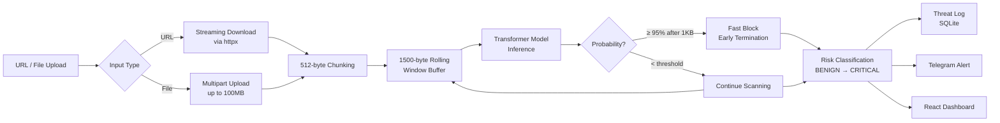
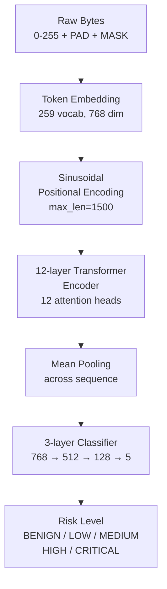
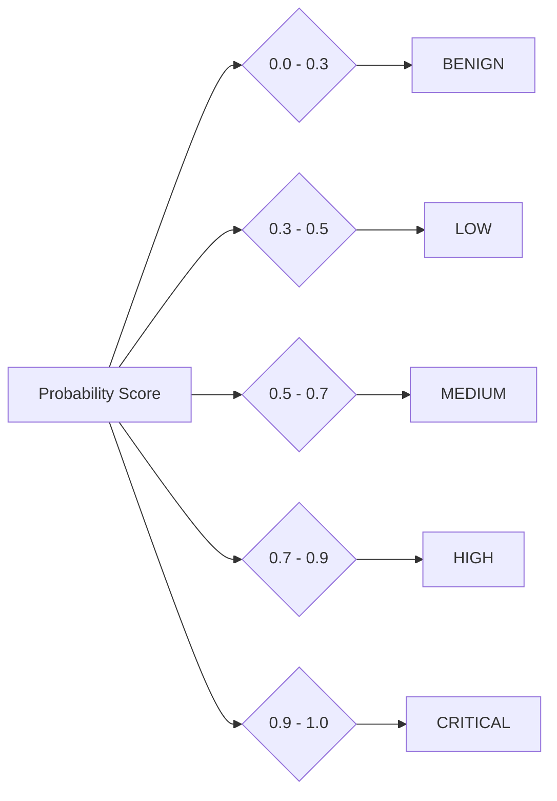
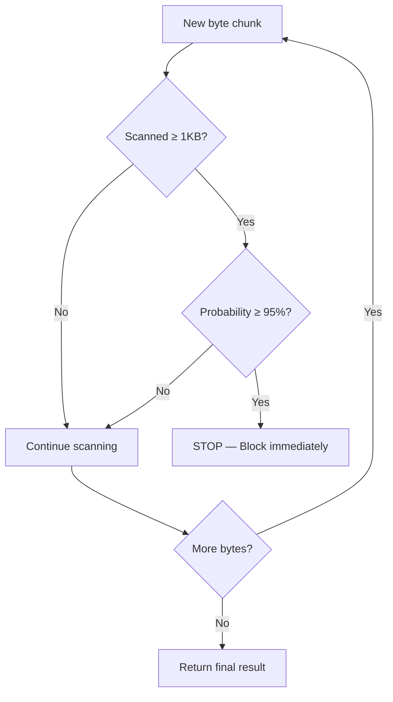
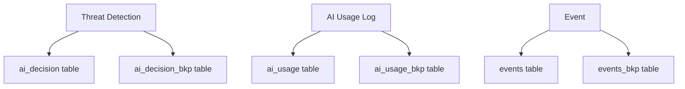
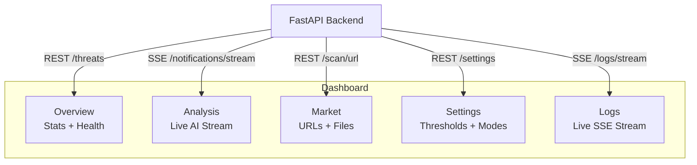
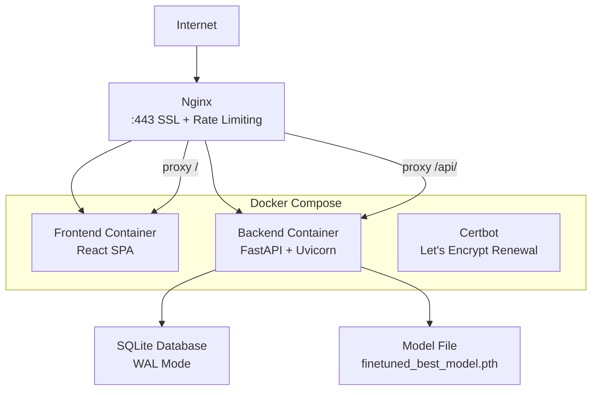
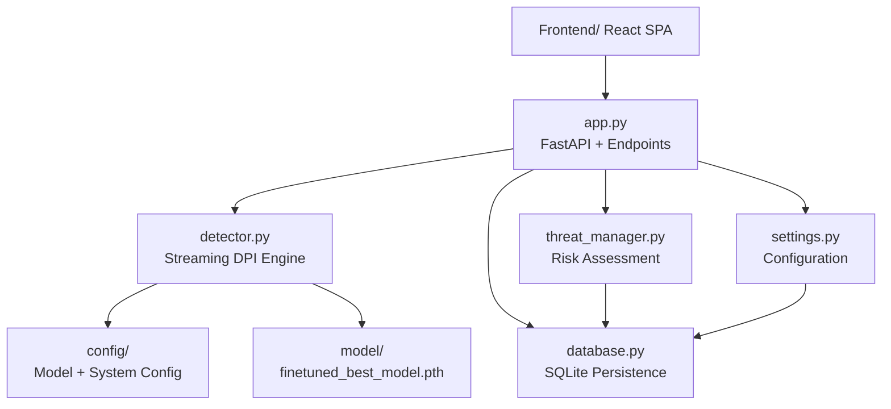

Every day, millions of malicious URLs and files slip through perimeter defenses. Traditional antivirus tools scan files after they land. Intrusion detection systems look for known signatures. But what if you could inspect the raw bytes of every request — in real-time — and catch malware before it reaches its target?

That's what **Packet Inspection Transformer V3** does. It's a Deep Packet Inspection (DPI) gateway that uses a Transformer model to analyze raw byte sequences from network traffic and file uploads, classifying them into 5 risk levels from BENIGN to CRITICAL.

And it does all of this in real-time, streaming data through 512-byte chunks with a 1500-byte rolling window.

---

## The Problem with Traditional Detection

Signature-based antivirus tools have a fatal flaw: they can only catch what they've already seen. A new malware variant, slightly obfuscated, slips right past.

The alternative — sandboxing every file in a VM — is too slow for real-time traffic. You can't ask a user to wait 30 seconds while a URL gets analyzed in a virtual machine.

So I built something in between: a lightweight Transformer model that reads raw bytes directly, learns patterns from data, and makes predictions in under 100ms. No sandbox. No signatures. Just learned byte-level patterns.

---

## The Data Flow



The key insight is the **rolling window**. The system never loads an entire file into memory. It processes data in 512-byte chunks, maintaining a 1500-byte context window that slides forward as new bytes arrive. This keeps memory usage constant regardless of file size.

---

## The Transformer Model

The detection engine is based on the [Packet Inspection Transformer with Masked Byte Prediction](https://arxiv.org/abs/2108.12816) architecture:



### Model specs

| Parameter | Value |
|---|---|
| Layers | 12 |
| Attention heads | 12 |
| Embedding dim | 768 |
| Feedforward dim | 3072 |
| Vocabulary | 259 (byte values 0-255 + padding, mask, unknown) |
| Max sequence length | 1500 |
| Output classes | 5 (BENIGN → CRITICAL) |

The classifier uses mean pooling over the sequence dimension, followed by a 3-layer feedforward head with ReLU and dropout. Temperature scaling smooths the sigmoid outputs for better calibration.

---

## Risk Classification

Every detection result gets a risk level based on configurable probability thresholds:



These thresholds are configurable at runtime via the API — no restart needed.

---

## Streaming Deep Packet Inspection

The core of the system is the `StreamingDetector`. It processes data in 512-byte chunks using a sliding 1500-byte window:

```python
class StreamingDetector:
    def __init__(self, model, window_size=1500, chunk_size=512):
        self.window = bytearray(window_size)
        self.pos = 0
        self.lock = threading.Lock()

    def feed(self, chunk: bytes) -> dict:
        with self.lock:
            self.window[self.pos:self.pos + len(chunk)] = chunk
            self.pos += len(chunk)

            if self.pos >= self.min_scan_bytes:
                result = self._inference()
                if result.probability >= self.fast_block_threshold:
                    return self._early_terminate(result)

            return {"status": "scanning", "bytes_processed": self.pos}
```

### Early termination (fast block mode)

When enabled, the system stops scanning the moment a high-confidence threat is detected after a minimum number of bytes have been analyzed. For confirmed malware, this cuts processing time by roughly **50%** — you don't need to scan 10MB of a file if the first 1KB already says "malware."



---

## Three Modes of Operation

The system isn't just a passive scanner. It can run in multiple modes depending on the use case:

| Mode | Behavior |
|---|---|
| `live` | WebSocket streaming + ANSI terminal dashboard — press `s` to send to AI |
| `continuous` | Repeating scan cycle every 60s — watch the market in real-time |
| `static` | One-shot analysis — drop a file or URL, get a result, done |
| `offline` | No AI model needed — uses a rule-based heuristic scorer |
| `api` | Headless FastAPI server only — connect the frontend or call from scripts |

The `offline` mode is the safety net. If the model fails to load, or you're running on a machine without PyTorch/CUDA, the heuristic scorer still produces reasonable risk assessments based on byte-level patterns.

---

## API Design

The backend exposes a clean REST API with SSE streaming:

| Endpoint | Method | Purpose |
|---|---|---|
| `/scan/url` | POST | Download and scan a URL with early termination |
| `/scan/file` | POST | Upload and scan a file (max 100MB) |
| `/threats` | GET | List threat logs with pagination and filters |
| `/threats/stats` | GET | Aggregated threat statistics |
| `/settings/threshold` | POST | Update detection threshold at runtime |
| `/settings/early-termination` | POST | Toggle fast block mode |
| `/health` | GET | System health (model, DB, memory) |
| `/notifications/stream` | GET | SSE — real-time threat alerts |
| `/logs/stream` | GET | SSE — live application logs |

The SSE endpoints use heartbeat messages every 30 seconds to keep connections alive. New connections receive the last 100 buffered entries on connect, so you never miss recent events.

---

## Persistence: SQLite with Backup Mirrors

Every threat detection is persisted to SQLite with proper indexes on timestamp, risk level, source, and blocked status. The database runs in WAL mode for concurrent reads and writes.

What's interesting is the **backup mirror** pattern. Every primary insert is also written to a `_bkp` table:



This gives you audit trails and recovery capability without any external tools. If something corrupts the primary table, the backup has your data.

---

## Frontend Dashboard

The React frontend gives you a live view of everything happening in the system:



Built with React 18 + TypeScript, TanStack Query for data fetching, Tailwind CSS v4 + shadcn/ui for styling, and Recharts for threat distribution charts. The Analysis tab auto-opens when a scan starts, and the AI's response streams in token-by-token.

---

## Docker + Nginx Production Setup

For production, everything runs behind Nginx with SSL termination:



Nginx handles SSL termination via Let's Encrypt (with automatic renewal through Certbot), rate limiting to prevent abuse, gzip compression, and SPA routing (`try_files $uri $uri/ /index.html`).

The backend scales horizontally — just add `--scale backend=N` to Docker Compose.

---

## Model Loading Flexibility

The system is resilient about model loading. The `_load_model` method handles multiple checkpoint formats:

- Direct state dict
- Nested `model_state_dict` key
- Checkpoints with `transformer.` or `classifier.` prefixes
- Ignores `mlm_decoder` weights from pretrained models
- Falls back to random initialization if the model file is missing

This means you can load checkpoints from different training runs without manual key remapping.

---

## Running It

### Docker (recommended)

```bash
git clone https://github.com/hareesh08/PacketInspectionTransformerV3.git
cd PacketInspectionTransformerV3
cp .env.example .env
# Edit .env with your DOMAIN and settings
docker compose up -d --build
```

### Native (non-Docker)

```bash
python -m venv venv
.\venv\Scripts\activate  # Windows
pip install -r requirements.txt

cd Frontend && npm install && cd ..

# Ensure model/ and logs/ directories exist
python app.py

# In another terminal
cd Frontend && npm run dev
```

### Windows quick start

The `setup_and_start.bat` script handles everything — finds Python, kills existing processes, installs dependencies, and starts both backend and frontend.

---

## Architecture at a Glance

The codebase follows a clean modular structure:



Each module has a single responsibility. The detector handles byte streaming and inference. The threat manager handles risk classification and alerting. The database handles persistence. The settings module handles configuration with environment overrides.

---

## What Makes This Different

Most malware scanners work on one of two extremes: signature-based (fast but blind to new malware) or sandbox-based (thorough but slow). This system sits in the middle — it's fast like a signature scanner but adaptive like a sandbox.

The Transformer learns byte-level patterns from data. It doesn't need to see the exact same bytes twice. It catches obfuscated malware, polymorphic variants, and zero-day threats that signature databases haven't indexed yet.

The streaming architecture means it can handle arbitrarily large files (up to 100MB) without loading them entirely into memory. And the fast block mode means confirmed threats get blocked in milliseconds, not seconds.

---

## What's Next

- **Multi-model ensemble** — combine Transformer output with traditional signature matching
- **Behavioral analysis** — track sequences of detections over time for context-aware scoring
- **Protocol-aware inspection** — parse HTTP, DNS, TLS headers before byte analysis
- **Distributed scanning** — scale horizontally across multiple backend instances
- **Explainability** — highlight which byte sequences triggered the detection

---

## Source

[github.com/hareesh08/PacketInspectionTransformerV3](https://github.com/hareesh08/PacketInspectionTransformerV3)
