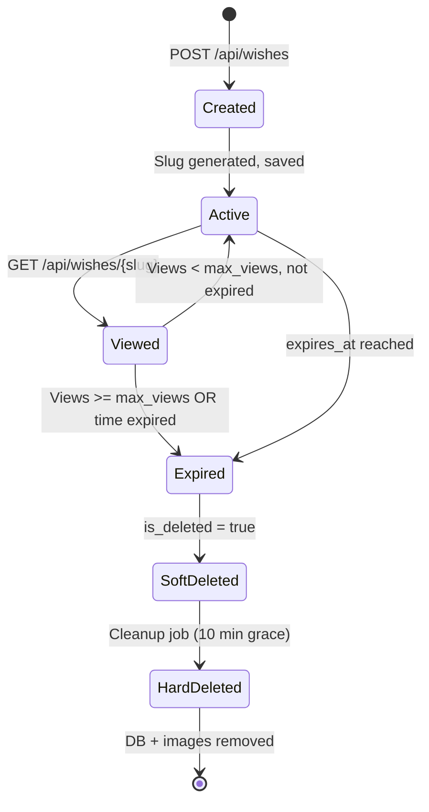
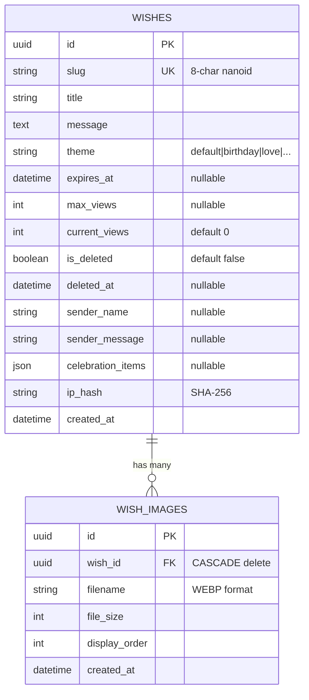
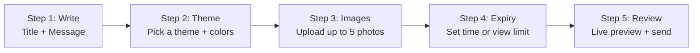
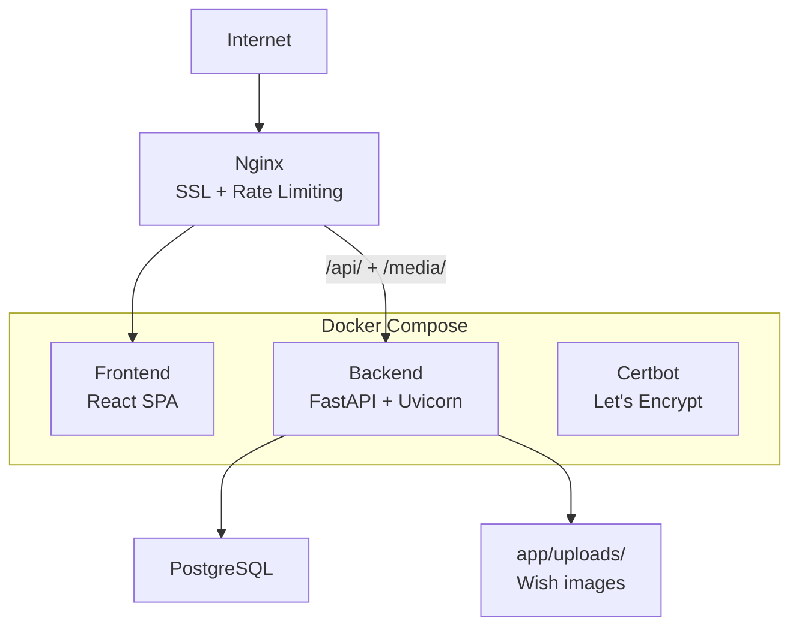

We all have that one wish we want to send — a birthday message, a love note, a celebration — that feels more special when it disappears after being seen.

That's the idea behind **Wish-A-Day**: a wish-sharing platform where every wish is self-destructing. Set a time limit, set a view limit, or both. Once the wish has been seen enough times — or the clock runs out — it's gone forever. No trace.

Here's how I built it.

---

## The Core Idea

```mermaid
flowchart LR
    A[Create Wish] --> B[Generate nanoid slug]
    B --> C[Share link: /w/{slug}]
    C --> D[Recipient opens link]
    D --> E[Wish revealed]
    E --> F{Expired?}
    F -->|No| G[Increment view count]
    G --> H{Max views reached?}
    H -->|Yes| I[Self-destruct: 410 Gone]
    H -->|No| J[Wish remains accessible]
    F -->|Yes| I
```

Simple, right? Create a wish, get a link, send it to someone. They open it, see it once (or for a limited time), and then it vanishes.

---

## What Makes It Special

Wish-A-Day isn't just a link shortener with a pretty face. The wish viewing experience is the star of the show:

```mermaid
graph TD
    A[Open /w/{slug}] --> B[3D Gift Box<br/>Three.js / react-three/fiber]
    B --> C[Tap to "unwrap"]
    C --> D[Particle explosion]
    D --> E[Wish revealed with<br/>theme background + music]
    E --> F[Social sharing + QR code]

    G[11 Themes] --> E
    G -->|default| H[Soft gradients]
    G -->|birthday| I[Balloons + cake]
    G -->|love| J[Hearts + warmth]
    G -->|celebration| K[Confetti + sparkle]
    G -->|wedding| L[Elegant gold]
    G -->|valentine| M[Red + roses]
    G -->|festival| N[Colorful + lights]
```

Each theme has a unique gradient, overlay, particle color scheme, and even background music. The 3D gift box opener makes the reveal feel like an event, not just a page load.

---

## The Backend

FastAPI + SQLAlchemy 2.0 + SQLite (development) / PostgreSQL (production). Clean, typed, and fast.

### Wish Lifecycle



### Key backend features

| Feature | How it works |
|---|---|
| **Self-destruction** | Two expiry modes — time-based (`expires_at`) or view-based (`max_views`). Once either condition is met, the wish returns HTTP `410 Gone`. |
| **Soft delete + grace period** | Expired wishes are marked `is_deleted=True`. A background cleanup job (APScheduler, every 30 min) permanently removes them after a 10-minute grace period, also deleting image files from disk. |
| **Rate limiting** | Max 10 wishes per IP per day (in-memory counter, noted for Redis migration). Returns HTTP 429 when exceeded. |
| **Image processing** | Up to 5 images per wish, auto-converted to WEBP at 85% quality via Pillow. Files stored at `uploads/wishes/{wish_id}/`. |
| **Disk space guard** | Uploads blocked if free disk space drops below 1GB (HTTP 507). |
| **Nanoid slugs** | 8-character URL-safe unique slugs generated via `nanoid`. |
| **Sender info** | Optional `sender_name` (100 chars) and `sender_message` (200 chars) attached to each wish. |

---

## The Data Model

Two tables, clean and simple:



The `celebration_items` JSON field stores optional celebratory elements — chocolates, cake, balloons, poppers, gifts, confetti — each with type, quantity, color, and message.

---

## The Frontend Experience

The React frontend is where Wish-A-Day comes alive. Built with React 18 + TypeScript + Vite, styled with Tailwind CSS v4 and shadcn/ui.

### Three pages, three vibes

```mermaid
graph LR
    A[/] --> B[Home<br/>Hero + Features + CTA]
    A --> C[/create<br/>Multi-step form with<br/>live preview + theme picker]
    A --> D[/w/:slug<br/>3D gift box unboxing<br/>+ particle effects + theme music]

    D --> E[Share panel<br/>QR code + copy link]
    C --> F[Expiry picker<br/>+ image uploader<br/>+ celebration items]
```

### The WishView page

This is the hero moment. When someone opens a wish link:

1. A 3D gift box appears (Three.js via `@react-three/fiber` + `@react-three/drei`)
2. You tap or click the box
3. It "unwraps" with an animation
4. Particles explode outward
5. The wish fades in with its theme background, gradient overlay, and (optionally) music
6. A sharing panel appears with a QR code and copy-link button

### The CreateWish page

Multi-step form with progress indicator:



A live preview updates as you fill in each step. The theme selector shows a mini gradient preview. Image uploads convert to WEBP before they even leave your browser.

---

## Image Processing

Uploaded images go through a processing pipeline before being stored:

```mermaid
flowchart LR
    A[Upload] --> B[Validate<br/>type + size + extension]
    B --> C[Convert to RGB<br/>if needed for WEBP]
    C --> D[Resize + compress<br/>WEBP quality=85<br/>method=6]
    D --> E[Save to disk<br/>uploads/wishes/{id}/]
    E --> F[Create DB record<br/>WishImage]

    G[Disk check < 1GB?] -->|No| H[Reject: HTTP 507]
    G -->|Yes| A
```

Pillow handles the conversion. The `method=6` parameter trades a bit of speed for better compression — worth it for web delivery.

---

## Background Cleanup

A background job runs every 30 minutes to keep the database and disk clean:

```python
@ scheduler.scheduled_job("interval", minutes=30)
def cleanup_expired_wishes():
    grace_period = datetime.utcnow() - timedelta(minutes=10)
    soft_deleted = db.query(Wish).filter(
        Wish.is_deleted == True,
        Wish.deleted_at < grace_period,
    ).all()

    for wish in soft_deleted:
        shutil.rmtree(f"uploads/wishes/{wish.id}")  # Delete image files
        db.delete(wish)                             # Delete DB record
```

The 10-minute grace period means if you accidentally delete a wish, there's a small window to recover it from the database backup.

---

## Deployment

Wish-A-Day lives at **wishaday.hareeshworks.in**, deployed with:



Production uses PostgreSQL instead of SQLite, with Nginx handling SSL termination, static file serving, and API proxying. The frontend is built as a static SPA and served by Nginx.

---

## The Stack

| Layer | Technology |
|---|---|
| **Backend** | FastAPI, SQLAlchemy 2.0, Pydantic v2, APScheduler |
| **Database** | SQLite (dev) / PostgreSQL (prod) |
| **Image Processing** | Pillow (WEBP conversion) |
| **Frontend** | React 18, TypeScript, Vite, Tailwind CSS v4 |
| **UI** | shadcn/ui (Radix primitives) |
| **3D** | Three.js / @react-three/fiber / @react-three/drei |
| **Animations** | Framer Motion |
| **Data Fetching** | TanStack React Query |
| **Forms** | React Hook Form + Zod |
| **Charts** | Recharts |
| **QR Codes** | qrcode.react |
| **Testing** | pytest (backend), Vitest + Testing Library (frontend) |
| **Linting** | Black, isort, mypy, ESLint |

---

## Running It

### Backend

```bash
git clone https://github.com/hareesh08/Wish-A-Day.git
cd Wish-A-Day
python -m venv venv
.\venv\Scripts\activate
pip install -e ".[dev]"
cp .env.example .env
python scripts/init_db.py
uvicorn app.main:app --reload --port 8000
```

### Frontend

```bash
cd frontend
npm install
npm run dev
# → http://localhost:8080
```

---

## The Little Details

- **Rate limiting** is in-memory with a note to migrate to Redis in production.
- **Admin endpoints** (`/admin/cleanup`, `/admin/status`) exist but aren't authenticated yet — flagged for production hardening.
- **Disk space guard** blocks uploads when free space drops below 1GB.
- **WishView supports content negotiation** — browsers get HTML, API clients get JSON, all from the same `/w/{slug}` endpoint.
- **OG meta tags** are dynamically set per wish for beautiful link previews when shared.

---

## What's Next

- **Redis rate limiting** — replace the in-memory counter for production scale
- **Authenticated admin panel** — protect the cleanup and status endpoints
- **Wish templates** — pre-built wish formats for common occasions
- **Scheduled delivery** — send a wish at a specific future date/time
- **Wish reactions** — let recipients react with emoji
- **Wish chains** — a wish that unlocks another wish
- **Email delivery** — send wish links via email instead of just sharing links

---

## Source

[github.com/hareesh08/Wish-A-Day](https://github.com/hareesh08/Wish-A-Day)

Live at [wishaday.hareeshworks.in](https://wishaday.hareeshworks.in)
